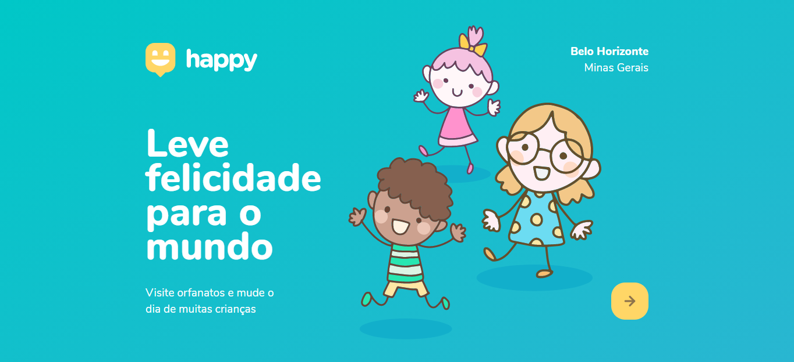

<h1>Happy</h1>

<h2>🎨 Layout</h2>

<h2>🚀 Tecnologia </h2>

Esse projeto foi desenvolvido utilizando as seguintes tecnologias:

<a href="https://nodejs.org/en/">Node</a> 
<a href="https://expressjs.com/">Express</a> 
<a href="https://www.sqlite.org/index.html">SQLite</a> 
<a href="https://handlebarsjs.com/">Handlebars</a>

<h2>💻Projeto</h2>

Happy é uma plataforma que tem como objetivo facilitar o encontro de orfanatos por aqueles que desejam realizar visitas a crianças que necessitam de amor e solidariedade.
Projeto desenvolvido durante a NLW - Next Level Week#03 oferecida pela @Rocketseat.
